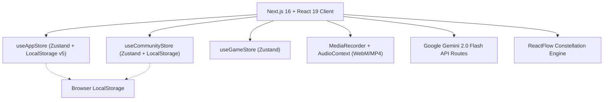
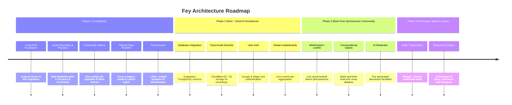

# Product Requirements Document (PRD): Fey

**Version:** 1.0.0  
**Status:** Approved & Living Document  
**Date:** September 2026  
**Product Vision:** *Fey — Think Deeper, Articulate Clearly.*

---

## 1. Executive Summary

Fey is an intellectual learning and vocal articulation platform built around the **Feynman Technique**: the principle that true understanding is demonstrated through concise, intuitive explanation in your own words.

Modern digital learning suffers from the *illusion of explanatory depth*—passive consumption (articles, videos, bookmarks) without retention or synthesis. Fey solves this by combining **timeboxed research sprints**, **real microphone vocal synthesis under pressure**, **honest self-reflection**, an expanding **knowledge constellation graph**, and **collaborative research salons**.

---

## 2. Core Value Propositions

1. **Active Synthesis Over Passive Consumption**: Users don't just read; they must explain their understanding out loud before the timer expires.
2. **Ritualistic Daily Habit**: Deterministic daily suggested topics strictly tailored to user interests, supported by 52-week activity heatmaps and motivational streaks.
3. **Visualized Intellectual Growth**: Completed topics form an interactive knowledge constellation graph (ReactFlow) showing mastery clusters and suggesting adjacent topics.
4. **Social Scholar Community**: Lightweight research rooms where friends or peers research the same topic and listen to each other's recorded explanations with star voting.
5. **Artful Editorial Aesthetic**: Grounded, distraction-free typographic palette (forest olive, terracotta burgundy, antique gold, sage) inspired by classical libraries and modern publications.

---

## 3. User Personas

| Persona | Motivation | Fey Feature Fit |
| :--- | :--- | :--- |
| **The Self-Directed Scholar** | Wants to systematically master diverse topics (AI, philosophy, history, economics) and build a daily thinking habit. | Daily tailored suggestion, research timer, constellation graph, reflection log. |
| **The Technical Communicator** | Engineers, product managers, and founders looking to articulate complex ideas clearly without jargon. | Speaking limit constraint (60s–180s), audio review playback, speech practice. |
| **The Social Learner** | Enjoys group study, intellectual debates, and hearing different viewpoints on nuanced questions. | Research rooms, decentralized room sharing, peer voice playback, star ratings. |
| **The Trivia & Knowledge Enthusiast** | Loves testing their breadth of knowledge across history, culture, and general facts. | 1,000+ question trivia arcade, rapid-fire word description party game (`/play`). |

---

## 4. Key Product Features & User Journeys

### 4.1. Onboarding & Personalization
- **Scholarly Identity**: Users select their display name, custom vector illustrated avatar (12 distinct academic roles), and learning mission (curated dropdown + custom mission).
- **Tailored Interest Selection**: Users choose from 20+ disciplines (Artificial Intelligence, Technology, Software Engineering, Philosophy, History, Economics, etc.).
- **Strict Preference Sync**: Onboarding selections strictly populate both `favoriteCategories` and `enabledCategories`, ensuring unselected topics (e.g., Psychology) never invade the user's daily suggestion pool.

### 4.2. Dashboard & Daily Ritual (`/`)
- **Today's Suggested Topic**:
  - Deterministic daily seed (stable across the day, rotates at midnight).
  - Strictly pulls from the user's enabled and favorite disciplines.
  - Displays difficulty tier, category badge, and XP reward (+100 to +200 XP).
- **Interactive Focus Roulette**:
  - Clicking the Fey butterfly spinner opens the **Focus Category Modal**.
  - Users can view topic counts across all their chosen categories, select a specific discipline to focus on, or spin across all active categories.
  - Direct callout link to `/discover` to manage or expand the category pool.
- **Progress Tracking**:
  - 52-week GitHub-style activity heatmap.
  - Weekly session bar chart.
  - Motivational streak counter and daily philosophical quote library.

### 4.3. Solo Feynman Sprint (`/session/[id]`)
- **Stage 1: Deep Research (10–30 min)**:
  - Full-featured TipTap rich text editor for writing structured notes, outlines, and checklists.
  - Prominent countdown timer ring with gentle visual alerts.
- **Stage 2: Vocal Synthesis (60–180 sec)**:
  - Real browser microphone recording using `MediaRecorder` API.
  - Live animated waveform and countdown timer.
  - Post-recording review player: users can listen to their explanation and re-record before continuing.
- **Stage 3: Reflection & Honest Scoring**:
  - Three synthesis prompts: *What was most interesting? What was hardest to explain? What would you explain differently next time?*
  - Self-rating on Confidence (1–5), Understanding (1–5), and Communication (1–5).
- **Stage 4: Summary & Rewards**:
  - XP awarded, level progress updated, and achievements checked against milestone criteria.
  - Session automatically indexed into the user's Library and Constellation Graph.

### 4.4. Community Research Salons (`/community`)
- **Start a Research Room**:
  - Topic selector with fuzzy multi-field search (text, category, tags) and instant recommendations.
  - Full **Custom Topic Support**: Users can type any research prompt or question directly from search or via the dedicated Custom Topic tab.
  - Configurable research time (10–30m) and speaking limits (60–180s), with Public / Private visibility.
- **Zero-Config Decentralized Sharing**:
  - Complete room state encoded into URL query parameters (`?code=...&r=...`), allowing instant sharing without a mandatory backend database.
  - New users landing on a room link are prompted to set up their identity, then immediately redirected into the active session.
- **In-Room Voice Recording & Playback**:
  - Real microphone audio recording in the Speaking Phase with in-room audio review and re-recording controls.
  - In Voting and Closed phases, every submission features an interactive Play/Pause button with animated waveform bars.
  - Submissions are permanently saved to the user's Library (`/library`) with audio streaming.
- **Social Follow Network**:
  - Inspect participant profile modal with follow/unfollow toggle.
  - "Following" feed showing active rooms hosted or joined by scholars you follow.

### 4.5. Knowledge Constellation Graph (`/constellation`)
- Interactive canvas powered by **ReactFlow**.
- Completed topics rendered as nodes clustered by category colors.
- Dynamic similarity scoring engine computes topical proximity based on shared categories and tags.
- Recommends next topics to explore based on current constellation branches.

### 4.6. Educational Trivia Arcade (`/games/trivia`)
- 1,000+ curated trivia questions across History, Pop Culture, and General Knowledge.
- Instant Review vs. Suspense Review modes.
- Timer countdowns (Quick 5m, Standard 10m, Marathon 15m), streak multipliers, detailed historical explanations, and deduplication tracking in local store.

### 4.7. Word Description Party Game (`/play`)
- Local multiplayer team party game (Taboo style).
- Browser speech recognition transcribes speech live.
- Real Gemini 2.0 Flash AI referee (`/api/ai/validate` and `/api/ai/check-violation`) enforces rules with phonetic leniency.

---

## 5. Technical Architecture

### 5.1. Tech Stack
- **Framework**: Next.js 16.2 (App Router), React 19, TypeScript.
- **Styling**: Tailwind CSS, CSS Custom Properties (Fey Semantic Design System), Lucide React.
- **Animations**: Framer Motion (staggered cards, spring transitions, modal backdrops).
- **Editor**: TipTap (StarterKit, TaskList, TaskItem, Link, Placeholder).
- **Visualization**: ReactFlow (Constellation), Recharts (Analytics & Trends).
- **Audio Engine**: `navigator.mediaDevices.getUserMedia`, `MediaRecorder`, `HTMLAudioElement`, Base64 serialization.
- **AI Integration**: Google Gemini 2.0 Flash (`/api/ai/validate`, `/api/ai/check-violation`, `/api/ai/pronunciation-coach`).

---

## 6. Architecture & Product Roadmap

### Phase 2: Cloud Sync & Persistence
- Replace `localStorage` Base64 audio strings with pre-signed upload URLs to Cloudflare R2 or AWS S3.
- Introduce Supabase / PostgreSQL backend for cross-device authentication and profile sync.
- Aggregate community room submissions into real-time global topic leaderboards.

### Phase 3: Conversational Voice Salons
- Evolve community rooms from isolated sequential speeches into live multi-turn conversations.
- WebRTC / LiveKit duplex audio streaming.
- Automated AI moderator (Fey) to summarize arguments and pose counter-questions.

### Phase 4: Socratic AI Speech Coach
- Automatic transcription of solo speaking recordings.
- Gemini Multimodal evaluation analyzing clarity, rhetoric, filler word density, and conceptual accuracy against scholarly consensus.
